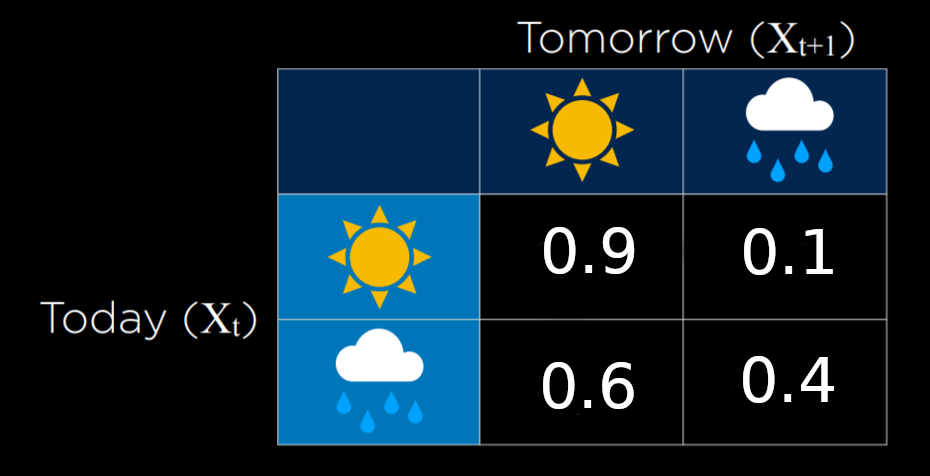
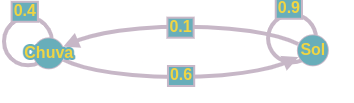

# Markov chain
Exercício para simulação de uma cadeia de markov.

Neste trabalho apresento um pouco sobre os conceitos de uma cadeia de markov e apresento um exemplo de simulação para previsão de chuva ou sol. 
COnsiderando o modelo de transição utilizado é possível observar que há uma tedenciosidade para previsão de sol do que de chuva, mostrando a necessidade que há em definir bem o modelo de transição que será utilizado.

#### Modelo utilizado

#### Grafo da cadeia

#### Referências

[CS50’s Introduction to Artificial Intelligence with Python](https://cs50.harvard.edu/ai/2020/notes/2/)
